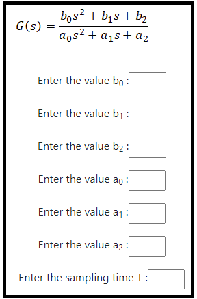
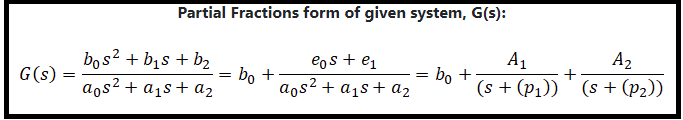
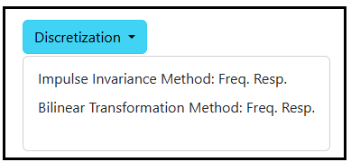
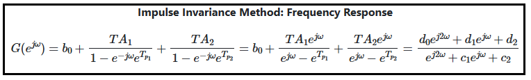

### Procedure

<b>Steps to perform the simulation</b>

										
1. At first enter the coefficient values of the transfer function and sampling time T. 

<b>Fig. 1. Coefficient values entry for continuous transfer function</b>						  

2. Click on 'G(s)' button to get the partial fraction form of the transfer function.

           

<b>Fig. 2. Partial fraction form of continuous transfer function</b>							  

3. Click on 'Discretization' dropdown-menu to get different methods.  

<b>Fig. 3. Dropdown menu button to get different discretization methods</b>							  

            
4. Click on the desired option to select the discrete form of the system.

<b>Fig. 4. Desired option to select the discrete form </b>						  

5. Click on the 'Run' button option to get the selected discrete form of the system.

<b>Fig. 5. Run button to get the selected discrete form </b>						  

	 					      

6. Results of the discretized form will be displayed for the selected method. 

7. Results of the discretized form: Impulse Invariance Method: Frequency Response. 

<b>Fig. 6. Discretization form of Impulse Invariance Method: Frequency Response</b>						 

8. Results of the discretized form: Bilinear Transformation Method: Frequency Response. 

<b>Fig. 7. Discretization form of Bilinear Transformation Method: Frequency Response </b>						 

9. Click on 'Plot Frequency Response' dropdown-menu to get the desired frequecy response plot. 

<b>Fig. 8. Dropdown button to get the desired plot </b>						 

10. Click on 'Clear' button to get results for new transfer function. 

11. Click on 'Download Plot' button to download the plot.
					 
12. Click on 'OK' button to clear the plot area.

13. Note: Run both the methods one after the another to compare the responses.

