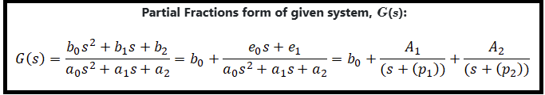
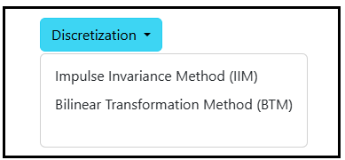
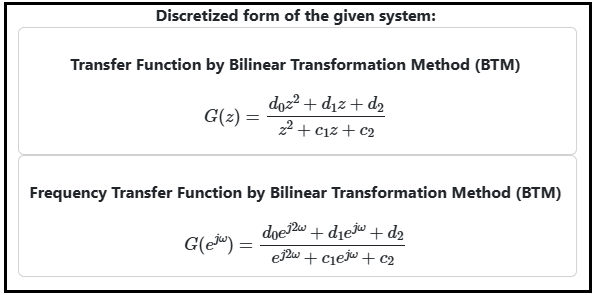

### Procedure

<b>Steps to perform the simulation</b>

<ol type="1">

<li> At first enter the coefficient values of the transfer function and sampling time T. </li> 

  
<b>Fig. 1. Coefficient values entry for continuous transfer function</b> 						  

 

<li> Click on 'G(s)' button to get the partial fraction form of the transfer function.</li> 

            

 

  
<b>Fig. 2. Partial fraction form of continuous transfer function</b> 							  

 

<li> Click on 'Discretization' dropdown-menu to get different methods.  </li> 

  
<b>Fig. 3. Dropdown menu button to get different discretization methods</b> 							  

 

<li> Click on the desired option to select the discrete form of the system.</li> 

  
<b>Fig. 4. Desired option to select the discrete form </b> 						  

 
<li> Click on the 'Run' button option to get the selected discrete form of the system.</li> 

  
<b>Fig. 5. Run button to get the selected discrete form </b> 						  

 	 					      

<li> Results of the discretized form will be displayed for the selected method. </li> 

<li> Results of the discretized form: Impulse Invariance Method: Frequency Response. </li> 

   
<b>Fig. 6. Discretization form of Impulse Invariance Method: Frequency Response</b> 						 

 

<li> Results of the discretized form: Bilinear Transformation Method: Frequency Response. </li> 

  
<b>Fig. 7. Discretization form of Bilinear Transformation Method: Frequency Response </b> 						 

 

<li> Click on 'Plot Frequency Response' dropdown-menu to get the desired frequecy response plot. </li> 

  
<b>Fig. 8. Dropdown button to get the desired plot </b> 						 

 

<li> Click on 'Clear' button to get results for new transfer function.</li>  

<li> Click on 'Download Plot' button to download the plot.</li> 

<li> Click on 'OK' button to clear the plot area.</li> 

<li> Note: Run both the methods one after the another to compare the responses.</li> 

</ol>

